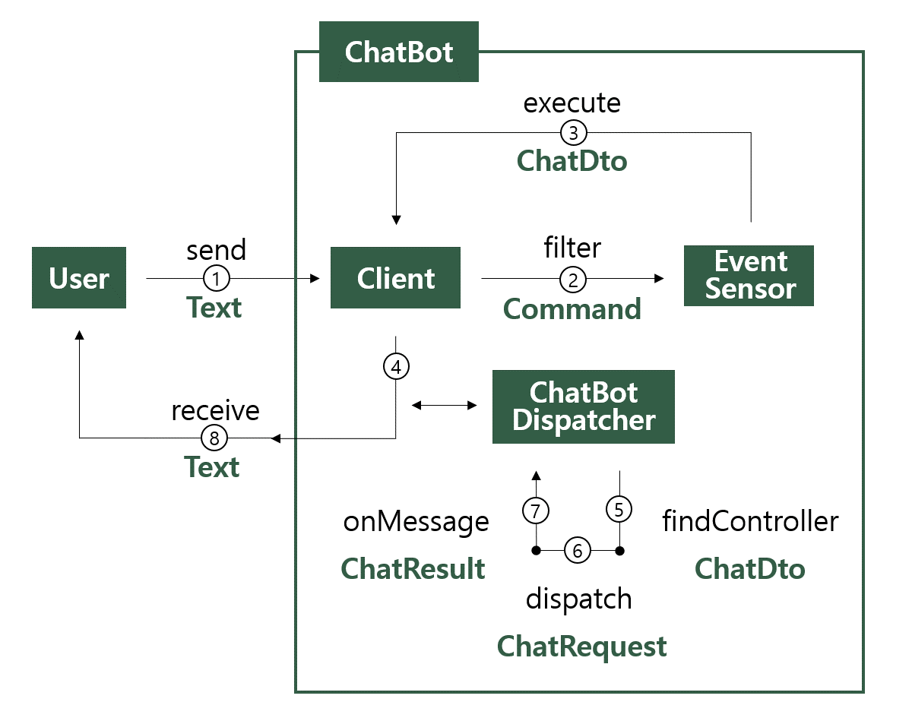

# Spring Boot ChatBot

Hi guys!

This is a `project to build a ChatBot Framework` based on Spring Boot.

# Author
- [junwork123](https://www.junwork.net/) (Project Owner)

# Feature

- `Spring Framework Based` Environment
- `Easy to Implement` each Platform(Discord, Line, Slack etc.)
- `Easy to expand` Commands & Actions

# Process

# Core Packages

- `domain` : this package is `focusing on Subject` like playing a Music, telling a joke or notice on Something via `Controller & Service`.

- `platform` : this package is implementation of ChatBot interfaces depend on specific platform such as Discord, Slack or Line.

# Core Concept

- `Command` : Command is Enum class for predefined Actions. it has a Meta-Info values for filtering or finding a controller.  

- `@CommandMapping` : This annotation helps us find controller and method to be executed. it needs String Value named `startCommand` matching `Command`. 

- `@ChatBotController` : Actually, This annotation is same as `@Controller`, But it could help `Dispatcher` and distinguish `@ChatBotController` from `@Controller` when Dispatcher finds a controller.     

- `ChatBotDispather` : this interface has 2 methods. One is `dispatch` for finding controller and method to be executed. Another is `onMessage` to invoke them.  

# Release Notes

# quick start

# example

# To-do

- Event Driven Architecture([ref](https://techblog.woowahan.com/7835/))
- Batch Service
- Auto Command Complete

# Thanks to
[kingbbode님](https://github.com/kingbbode/spring-boot-chatbot)